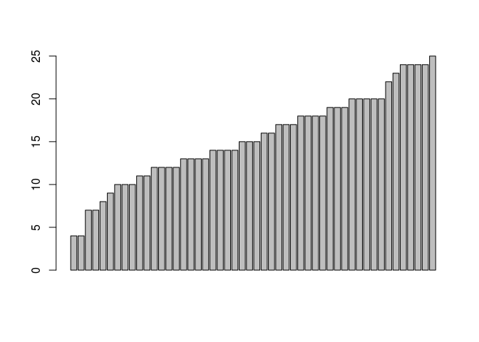
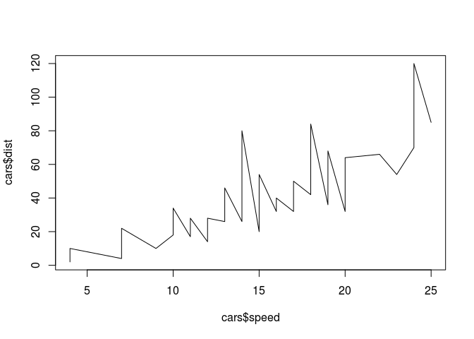

Kurzeinführung in R
================

R ist eine gratis Software zum statistischen Rechnen und Erstellen von Grafiken.

Nach der Installation kann man R auf verschiedene Weisen benutzen:

1.  Als Programm auf in dem man auf der Kommandozeile einfach `R` eintippt.
2.  als einfache grafische Benutzeroberfläche, oder
3.  in dem man `RStudio` öffnet.

R als Taschenrechner benutzen
-----------------------------

Man kann R ganz einfach als Taschenrechner benutzen, in dem man Rechenanweisungen eintippt und dann Enter drückt:

``` r
6 * 7 + 1.4
```

    ## [1] 43.4

Natürlich kann man auch über eine Vielzahl an eingebauten Rechen-Funktionen verfügen:

``` r
sqrt(81)
```

    ## [1] 9

``` r
cos(3.1415)
```

    ## [1] -1

Variablen
---------

Zwischenergebnisse kann man mit einem der drei Zuweisungsoperatoren als Variablen speichern. Die folgenden drei Anweisungen haben denselben Effekt:

``` r
a <- 5
5 -> a
a = 5
```

Jetzt können wir mit `a` rechnen als ob es eine Zahl wäre:

``` r
a + 10
```

    ## [1] 15

``` r
a * a
```

    ## [1] 25

Variablennamen dürfen in R so ziemlich alles enthalten was wir uns vorstellen können, aber wenn zu bunt wird, müssen wir sie in "backticks" einschließen:

``` r
langer_name <- 5
langer.name <- 5
geht.auch.mit.ümläuten <- 5
`variable mit leerzeichen` <- 5
```

Was nicht unbedingt immer praktisch ist, aber es funktioniert.

So kann man sogar Variablen in Zahlen speichern, was manchmal passiert wenn man Tabellen einliest, in denen Jahreszahlen in der Kopfzeile stehen:

``` r
`2000` <- 5
`2000` * `2000`
```

    ## [1] 25

Vektoren
--------

Mit der Funktion `c()` kann man mehrere Zahlen zu einem Vektor zusammenfassen.

``` r
b <- c(7, 2, 11, 4.5, 3)
```

Mit den eckigen Klammern können wir auf Elemente im Vektor zugreifen, wobei `1` das erste Element ist:

``` r
b[1]
```

    ## [1] 7

Mit Vektoren können wir genauso rechnen wie mit einzelnen Zahlen:

``` r
b + 10
```

    ## [1] 17.0 12.0 21.0 14.5 13.0

``` r
b * b
```

    ## [1]  49.00   4.00 121.00  20.25   9.00

Mit `sort()` kann man Vektoren sortieren:

``` r
sort(b)
```

    ## [1]  2.0  3.0  4.5  7.0 11.0

mit `min()`/`max()` kann man sich den kleinsten und größten Wert anzeigen lassen:

``` r
min(b)
```

    ## [1] 2

``` r
max(b)
```

    ## [1] 11

Mit `range()` bekommt man beides gleichzeitig:

``` r
range(b)
```

    ## [1]  2 11

Mit `length()` bekommen wir die Anzahl der Elemente:

``` r
length(b)
```

    ## [1] 5

Mit `sum()` bekommen wir die Summe der Elemente:

``` r
sum(b)
```

    ## [1] 27.5

Und wenn man Summe durch Anzahl teilt erhält man den Mittelwert:

``` r
sum(b) / length(b)
```

    ## [1] 5.5

Einfacher geht es mit `mean()`:

``` r
mean(b)
```

    ## [1] 5.5

Der Mittelwert ist bekanntlich ja nicht das gleiche wie der `median()`:

``` r
median(b)
```

    ## [1] 4.5

Eine Übersicht bekommt man mit `summary()`.

``` r
summary(b)
```

    ##    Min. 1st Qu.  Median    Mean 3rd Qu.    Max. 
    ##     2.0     3.0     4.5     5.5     7.0    11.0

Character
---------

R kann natürlich nicht nur Zahlen sondern auch Text. Diese kann man entweder mit einfachen oder doppelten Anführungszeichen einschließen:

``` r
a <- "R ist eine nützliche Sache"
```

Mehrere "character" Objekte lassen sich wie gewohnt als Vektoren zusammenfassen:

``` r
b <- c("Birne", "Banane", "Apfel", "Zitrone", "Banane", "Birne")
```

Mit `table()` kann ich schnell durchzählen wie oft jedes Wort vorkommt:

``` r
table(b)
```

    ## b
    ##   Apfel  Banane   Birne Zitrone 
    ##       1       2       2       1

Jetzt wissen wir schon genug um uns mit Tabellen in R zu beschäftigen.

Tabellen in R
-------------

Tabellarische Datensätze werden in R üblicherweise als "data frame" gespeichert. Man kann es sich vorstellen wie eine Sammlung von benannten Spalten-Vektoren die alle die gleiche Länge haben.

Es gibt eine Reihe von eingebauten Datensätzen zum Ausprobieren, wie z.B. `cars`

``` r
cars
```

    ##    speed dist
    ## 1      4    2
    ## 2      4   10
    ## 3      7    4
    ## 4      7   22
    ## 5      8   16
    ## 6      9   10
    ## 7     10   18
    ## 8     10   26
    ## 9     10   34
    ## 10    11   17
    ## 11    11   28
    ## 12    12   14
    ## 13    12   20
    ## 14    12   24
    ## 15    12   28
    ## 16    13   26
    ## 17    13   34
    ## 18    13   34
    ## 19    13   46
    ## 20    14   26
    ## 21    14   36
    ## 22    14   60
    ## 23    14   80
    ## 24    15   20
    ## 25    15   26
    ## 26    15   54
    ## 27    16   32
    ## 28    16   40
    ## 29    17   32
    ## 30    17   40
    ## 31    17   50
    ## 32    18   42
    ## 33    18   56
    ## 34    18   76
    ## 35    18   84
    ## 36    19   36
    ## 37    19   46
    ## 38    19   68
    ## 39    20   32
    ## 40    20   48
    ## 41    20   52
    ## 42    20   56
    ## 43    20   64
    ## 44    22   66
    ## 45    23   54
    ## 46    24   70
    ## 47    24   92
    ## 48    24   93
    ## 49    24  120
    ## 50    25   85

Auf die Spalten-Vektoren können wir mit der `$` Notation zugreifen:

``` r
cars$speed
```

    ##  [1]  4  4  7  7  8  9 10 10 10 11 11 12 12 12 12 13 13 13 13 14 14 14 14
    ## [24] 15 15 15 16 16 17 17 17 18 18 18 18 19 19 19 20 20 20 20 20 22 23 24
    ## [47] 24 24 24 25

und damit genauso rechnen wie mit anderen Vektoren auch:

``` r
summary(cars$speed)
```

    ##    Min. 1st Qu.  Median    Mean 3rd Qu.    Max. 
    ##     4.0    12.0    15.0    15.4    19.0    25.0

Mit `plot()` kann man nun einfache Visualisierungen von Tabellen erstellen:

``` r
plot(cars$speed, cars$dist)
```


Oder man erstellt ein Balkendiagramm:

``` r
barplot(cars$speed)
```



Oder ein Liniendiagramm:

``` r
plot(cars$speed, cars$dist, type='l')
```


