Statistische Daten und Wahlergebnisse als Bar-Codes visualisieren
================

In diesem Workshop geht es darum, Datensätze in RStudio zu analysieren und visualisieren. Genauergesagt werden wir uns Wahlergebnisse vergangener Bundestagswahlen anschauen, mit Strukturdaten der Wahlkreise kombinieren und als kompakte Strichcode-Diagramme darstellen.

Sämtliche Befehle, die wir in diesem Workshop ausführen werden, sind bereits in diesem Dokument gesammelt.

### RStudio

### Pipes

``` r
needs(readr, dplyr, ggplot2, gridExtra)
theme_set(theme_light())
```

Wahlergebnisse laden:

``` r
btw <- read_tsv('data/cleaned/btw13_kerg.csv',
                col_types=cols(Wahlkreis='c', .default = 'i'))
```

Gesamtstimmen der Koalitionen Rot-Rot-Grün (RRG) und CDU/CSU+FDP (CCF) berechnen:

``` r
btw_koal <- btw %>%
  mutate(RRG=SPD.Zweitstimmen + GRÜNE.Zweitstimmen + `DIE LINKE.Zweitstimmen`,
         CCF=coalesce(CDU.Zweitstimmen, CSU.Zweitstimmen) + FDP.Zweitstimmen) %>% 
  select(Nr, Wahlkreis, Land, RRG, CCF)
```

Prozentuale Stimmendifferenz zwischen den beiden Blöcken berechnen:

1.  margin = `100 * (CCF - RRG)/(CCF + RRG)`
2.  sieger
3.  landslide, wenn margin 10 Prozent oder mehr
4.  klasse

``` r
btw_margin <- btw_koal %>% 
  mutate(margin=round(100 * (CCF - RRG)/(CCF + RRG), 2)) %>% 
  mutate(sieger=ifelse(CCF > RRG, 'CCF', 'RRG')) %>% 
  mutate(landslide=abs(margin) >= 10) %>% 
  mutate(gruppe=paste0(ifelse(landslide,'L_','C_'), sieger)) %>% 
  mutate(gruppe=factor(gruppe, c('L_CCF', 'C_CCF', 'C_RRG', 'L_RRG')))
```

erstmal ein bisschen ansehen:

``` r
table(btw_margin$gruppe)
```

    ## 
    ## L_CCF C_CCF C_RRG L_RRG 
    ##   111    67    54    67

interessanterweise werden es immer weniger als mehr, anders als in den USA!

-   2005: 192
-   2009: 188
-   2013: 178

oder visualisieren, z.b. als Histogram:

``` r
btw_margin %>%
  ggplot(aes(margin)) +
  geom_histogram(binwidth = 5)
```

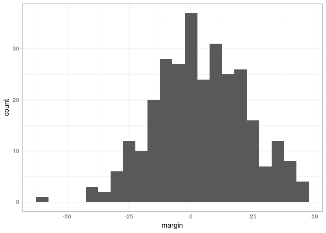

``` r
btw_margin %>%
  ggplot(aes(margin)) +
  facet_grid(gruppe ~ .) +
  geom_histogram(binwidth = 1)
```

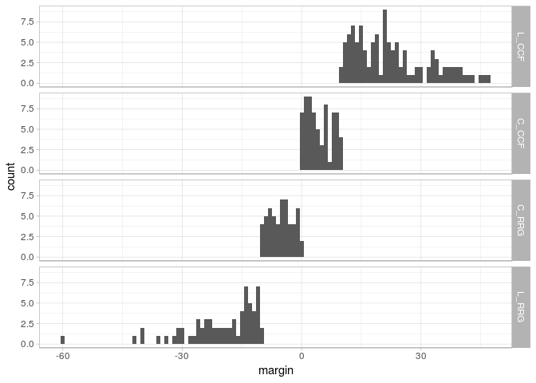

``` r
btw_margin %>%
  ggplot(aes(margin)) +
  facet_grid(gruppe ~ .) +
  geom_density(bw=1)
```

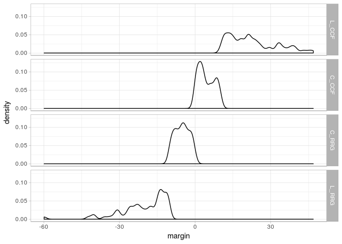

``` r
btw_margin %>%
  ggplot(aes(gruppe, margin)) +
  geom_boxplot() + 
  coord_flip()
```

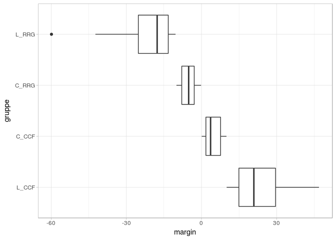

### Visualisierung

Strukturdaten dazuladen und per left\_join verbinden:

``` r
strukt <- read_tsv('data/cleaned/btw13_strukturdaten.csv', na = '–',
                   col_types = cols(Wahlkreis='c', .default = 'n')) %>% 
  select(-Wahlkreis) %>% 
  filter(Nr < 500) %>% 
  left_join(btw_margin, by ='Nr')
```

Bevölkerungsdichte nach Gruppen:
--------------------------------

``` r
colors <- c(L_CCF='#333333', C_CCF='#777777', L_RRG='#cc0000', C_RRG='#dd7777')

strukt %>% 
  select(sieger, gruppe, wert=Bevölkerungsdichte) %>% 
  ggplot(aes(x=wert, y=gruppe, color=gruppe)) +
  scale_colour_manual(values = colors) +
  geom_point()
```

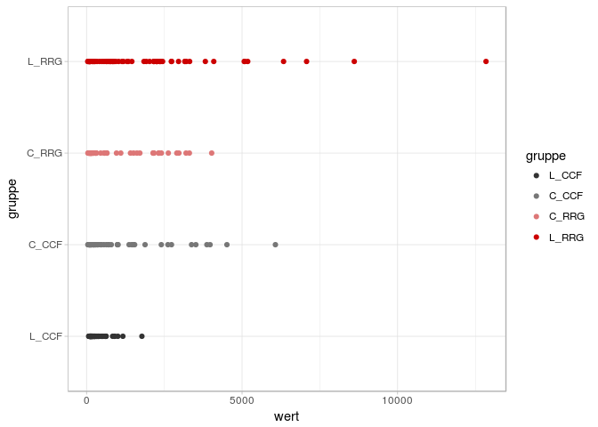

Aufgabe: + log-scale hinzufügen ^^

Bevölkerungsdichte nach Gruppen (logscale):

``` r
strukt %>% 
  select(sieger, gruppe, wert=Bevölkerungsdichte) %>% 
  ggplot(aes(x=wert, y=gruppe, color=gruppe)) +
  scale_colour_manual(values = colors) +
  geom_point() +
  scale_x_log10()
```

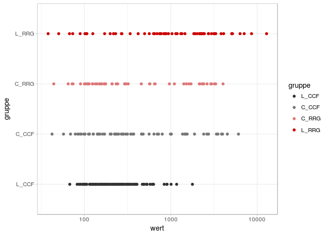

Histogramm: Problem dabei ist, wieviele Bins ich wählen soll

``` r
strukt %>% 
  #  filter(landslide) %>% 
  select(sieger, gruppe, value=Bevölkerungsdichte) %>% 
  ggplot(aes(value, fill=gruppe)) +
  facet_grid(gruppe ~ .) +
  geom_histogram(bins=50, alpha=0.6) +
  scale_fill_manual(values = colors, guide=F) +
  scale_x_log10() +
  theme_minimal()
```

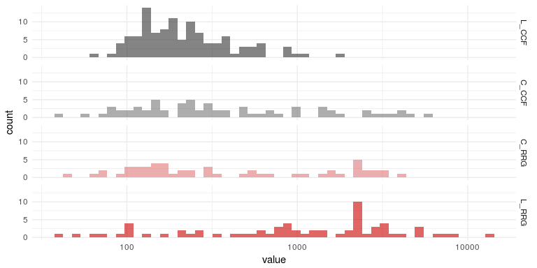

Eine clevere Alternative zu Histogrammen sind Density-Plots:

``` r
strukt %>% 
  #  filter(landslide) %>% 
  select(sieger, gruppe, value=Bevölkerungsdichte) %>% 
  ggplot(aes(value, fill=gruppe)) +
  facet_grid(gruppe ~ .) +
  geom_density(bw=.05, alpha=0.6, color=F) +
  scale_fill_manual(values = colors, guide=F) +
  scale_x_log10() +
  theme_minimal()
```

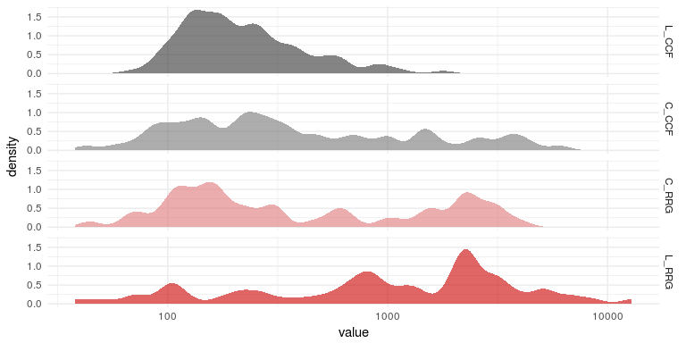

### Bar-Codes

``` r
strukt %>% 
  filter(landslide) %>% 
  select(sieger, gruppe, wert=Bevölkerungsdichte) %>% 
  ggplot(aes(wert)) +
  facet_grid(gruppe ~ .) +
  geom_vline(aes(xintercept=wert, color=gruppe), size=1.5, alpha=0.35) +
  scale_colour_manual(values = colors, guide=F) +
  scale_x_log10() +
  theme_minimal()
```

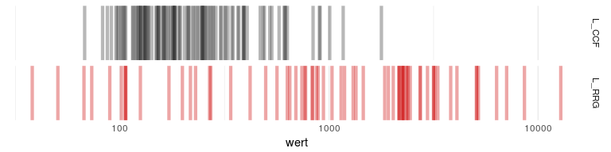

``` r
mittel <- strukt %>% 
  select(sieger, gruppe, wert=Bevölkerungsdichte) %>% 
  group_by(gruppe) %>% 
  summarize(avg=mean(wert), med=median(wert))

strukt %>% 
  filter(landslide) %>% 
  select(sieger, gruppe, wert=Bevölkerungsdichte) %>% 
  left_join(mittel, 'gruppe') %>% 
  ggplot(aes(wert)) +
  facet_grid(gruppe ~ .) +
  geom_vline(aes(xintercept=wert, color=gruppe), size=1.5, alpha=0.25) +
  geom_vline(aes(xintercept=avg), color='white', size=3, alpha=1) +
  geom_vline(aes(xintercept=avg), color='black', size=1, alpha=1) +
  scale_colour_manual(values = colors, guide=F) +
  scale_x_log10() +
  theme_minimal()
```

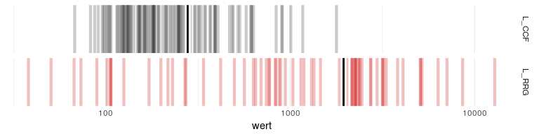

das ganze können wir in einer funktion speichern:

``` r
plot_bars <- function(spalte, log=FALSE) {
  
  plot_data <- strukt %>% 
    filter(landslide) %>% 
    select_('sieger', 'gruppe', wert=as.name(spalte)) %>% 
    mutate(wert=wert)

  mittel <- plot_data %>% 
    group_by(gruppe) %>% 
    summarize(avg=mean(wert), med=median(wert))
  
  plot <- plot_data %>% 
    left_join(mittel, 'gruppe') %>% 
    ggplot(aes(wert)) +
    facet_grid(gruppe ~ .) +
    geom_vline(aes(xintercept=wert + rnorm(nrow(plot_data), sd = 0.4), color=gruppe), size=1.5, alpha=0.25) +
    geom_vline(aes(xintercept=avg), color='white', size=5, alpha=0.5) +
    geom_vline(aes(xintercept=avg), color='black', size=1, alpha=1) +
    scale_colour_manual(values = colors, guide=F) +
    ggtitle(spalte) +
    theme_minimal() +
    theme(plot.margin = rep(unit(0.5,'cm'),4))
  
  if (log) plot <- plot + scale_x_log10()
  plot
}
```

``` r
#plot_bars('Bevölkerungsdichte', log=TRUE)
plot_bars('Alter.25-35')
```

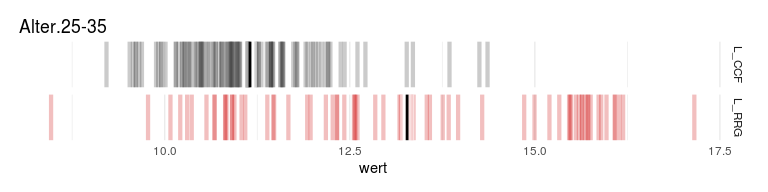

``` r
needs(gridExtra)

plots <-  lapply(colnames(strukt)[2:40], plot_bars)

plots.layout <- marrangeGrob(plots, nrow=7, ncol=1)
```

    ## Warning: Removed 2 rows containing missing values (geom_vline).

    ## Warning: Removed 67 rows containing missing values (geom_vline).

    ## Warning: Removed 67 rows containing missing values (geom_vline).

``` r
ggsave("plots.pdf", plots.layout, width=21, height=27.9, units='cm')
```
